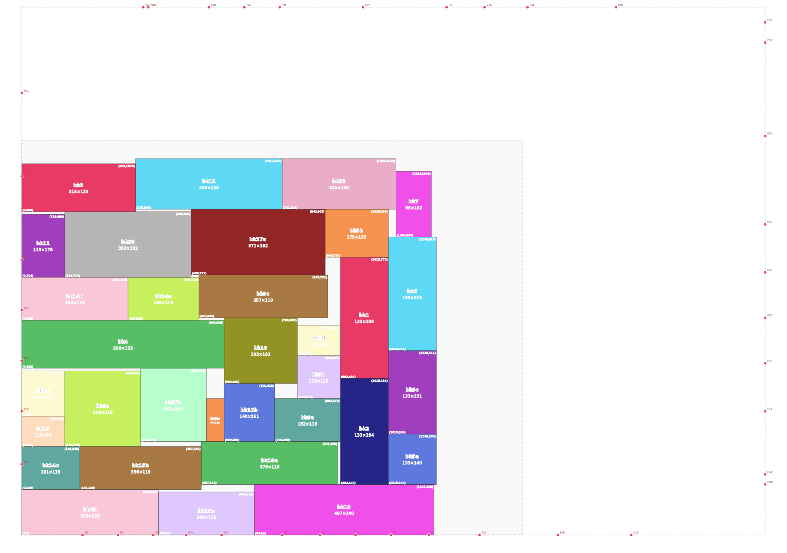
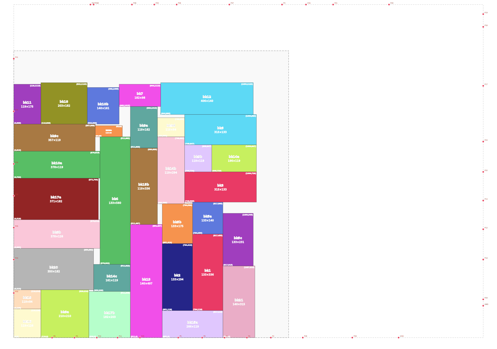
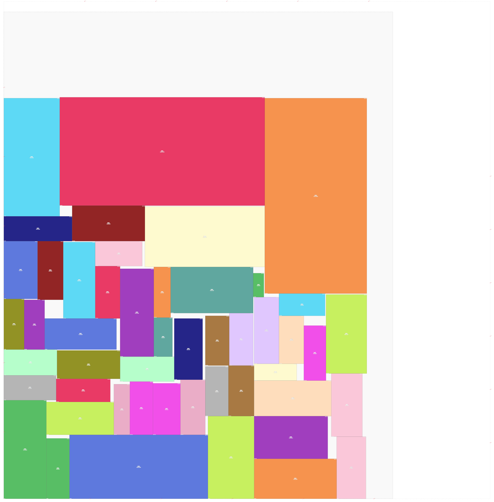
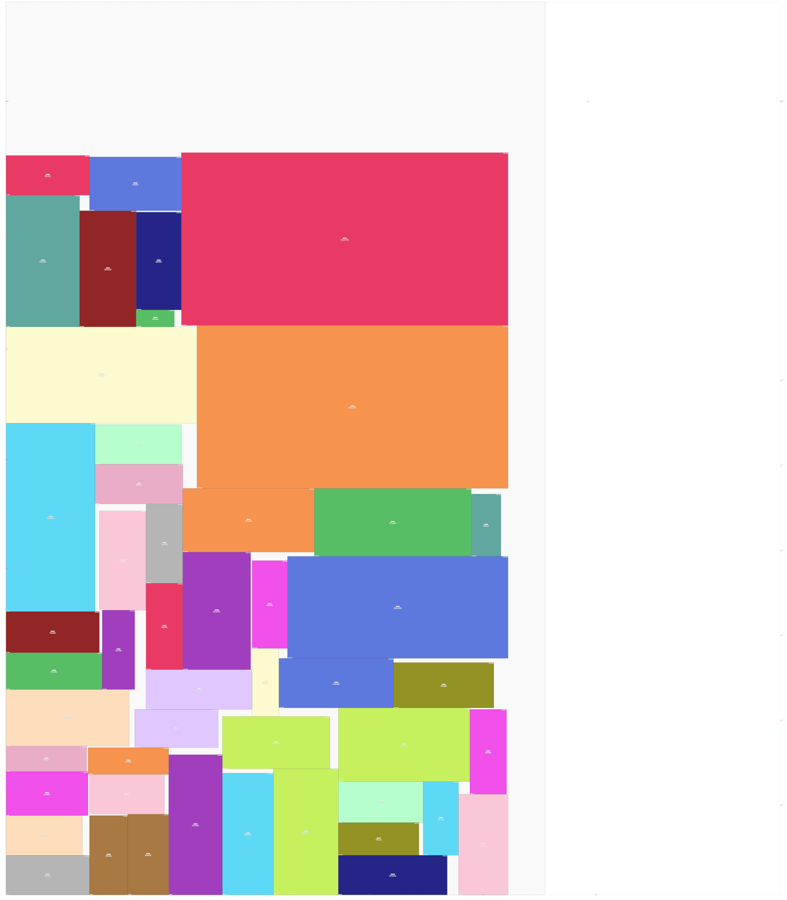
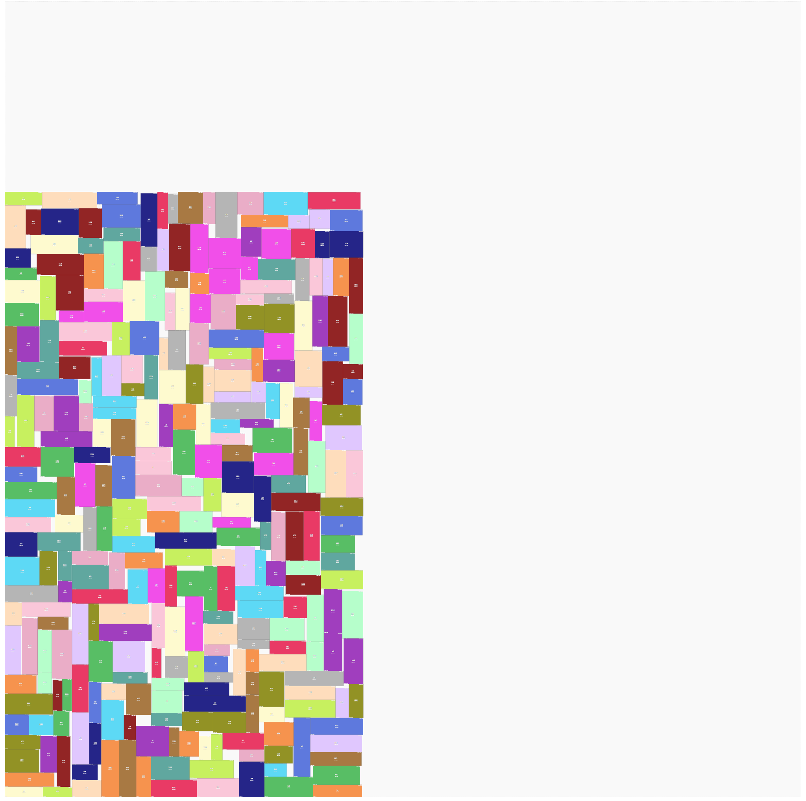

# Fixed Outline Floorplanning
Fixed-outline floorplanning arranges a set of rectangular hard macros within a given chip boundary without overlaps, minimizing both the total layout area and the interconnect wirelength between blocks. It is a core step in physical design, determining the spatial organization of functional units before placement and routing, and directly impacting chip area, performance, and power consumption.

## Problem Formulation
Given a fixed chip outline, a set of hard macros each with a fixed width and height, a set of fixed-position terminals located on or outside the outline, and a set of nets each connecting a subset of macros and terminals, the goal is to find a non-overlapping placement of all macros within the outline that minimizes a weighted sum of the bounding-box area and the total wirelength. The total wirelength is computed as the sum of half-perimeter wire lengths over all nets, where the center point of each macro serves as its pin location with coordinates truncated to integers. The weighting between area and wirelength is controlled by a user-specified parameter ranging from 0 to 1. Any placement in which one or more macros fall outside the given outline is considered invalid and rejected.

## Features
- **Modular Architecture**: separated into `BStarTree`, `SAEngine`, and `Floorplanner` modules for tree topology, optimization scheduling, and I/O coordination.
- **B\*-Tree Floorplan**: encodes block adjacency as a binary tree; packed in O(N log N) via iterative DFS with a map-based contour; perturbations use pointer-patch rollback for O(1) undo.
- **Simulated Annealing**: multi-restart with time-seeded RNG, adaptive outline penalty, and decaying reheat from local best.

## Processing Pipeline
1. **Parse**: read outline, block dimensions, terminal positions, and net membership from `.block` and `.nets`.
2. **Init**: build B\*-tree in area-descending order and set initial penalty weight λ.
3. **SA**: run multi-restart simulated annealing until time limit.
   1. **T0 Estimation**: sample 200 random moves to calibrate initial temperature at ~50% acceptance.
   2. **Inner Loop**: apply perturbation → pack → evaluate → accept/reject via Metropolis criterion.
   3. **Cooling**: multiply T by 0.995 each round; reheat to local best when T drops below threshold.
   4. **Restart**: re-seed RNG and shuffle tree order if no improvement for `noImproveTimeSec`.
4. **Output**: write cost, HPWL, area, dimensions, runtime, and per-block coordinates to report.

## Parameters
- **alpha** (0–1): weight between chip area and HPWL.
- **totalTimeSec** (default 280 s): total wall-clock budget across all restarts.
- **noImproveTimeSec** (default ~33 s): no-improve window before restart; 12% of total budget.
- **coolRate** (default 0.995): geometric cooling multiplier per inner loop.
- **innerFactor** (default 12): inner loop length = `n × innerFactor`.
- **lambda**: outline violation penalty; ×1.08 per out-of-bound round, ×0.99 per in-bound round.

## Input / Output Format

### Input
- Terminals are on or outside the outline, never inside a block.
- The number of nets, blocks, and terminals is each under 500.
- All values are integers.

**Input.block**
- Outline defines the fixed chip boundary with lower-left corner at origin.
- Terminals are on or outside the outline, never inside a block.
- Number of blocks and terminals each under 500.
- All values are integers.
```
Outline: <outline_width> <outline_height>
NumBlocks: <num_blocks>
NumTerminals: <num_terminals>
          # separated by one empty line
<macro_name> <macro_width> <macro_height>
# repeat <num_blocks> times
          # separated by one empty line
<terminal_name> terminal <terminal_x> <terminal_y>
# repeat <num_terminals> times
...
```

**Example**
```
Outline: 1385 1095
NumBlocks:  33
NumTerminals: 40

bk1   336  133
bk10a 378  119
bk10b 161  140
bk10c 119  49
bk11  175  119
...

VSS terminal         1281	1463
VDD terminal         1687	0
P9 terminal          266	0
P8 terminal          168	0
P7 terminal          924	0
...
```

**Input.nets**
- Number of nets under 500.
- All values are integers.
```
NumNets: <num_nets>
NetDegree: <num_blks_in_net>
<blk_name>
# repeat <num_nets> times
...
```

**Example**
```
NumNets: 121
NetDegree: 34
GND
bk1
bk10a
bk10b
bk10c
...
```

### Output
- All coordinates must be integers.
- Final cost must be an integer.
- The center point of each macro, truncated to integer, is used as its pin location.
- $\text {HPWL} = \lfloor x_{max} \rfloor - \lfloor x_{min} \rfloor + \lfloor y_{max} \rfloor - \lfloor y_{min} \rfloor$
- $\text{W} = \sum_{n_i\in N} \text{HPWL}(n_i)$
- $\text{Cost} = \alpha \text{A} + (1 - \alpha)\text{W}$

**Output.rpt**
```
<final_cost>
<total_wirelength>
<chip_area>
<chip_width> <chip_height>
<runtime>
<macro_name> <lower_left_x> <lower_left_y> <upper_right_x> <upper_right_y>
# repeat <num_blocks> times
...
```

**Example**
```
303420
79935
1197364
1148 1043
280.003
bk1 882 434 1015 770
bk10a 497 140 875 259
bk10b 560 259 700 420
...
```


## Directory Structure
```
Lab2/
  ├── Makefile             // Build script to compile the project
  ├── visualizer.py        // Python script to visualize floorplan result
  ├── verifier             // Executable to verify output correctness
  ├── dataset/
  │   └── <case>
  │       ├── <case>.block
  │       └── <case>.nets
  ├── images/
  │   └── <case>.svg
  │
  ├── include/
  │   ├── floorplan.h
  │   ├── BStarTree.h
  │   ├── SA.h
  │   └── Types.h          // Shared data structures: Block, Terminal, Net, and chip dimension helpers
  │
  ├── src/
  │   ├── main.cpp
  │   ├── floorplan.cpp    // Fixed-outline floorplanner coordinating parse, cost evaluation, and SA optimization
  │   ├── BStarTree.cpp    // B*-tree construction, packing, and perturbation with O(1) pointer-patch rollback
  │   └── SA.cpp           // Simulated annealing engine with multi-restart and decaying reheat strategy
  │
  ├── build/               // Object (.o) and dependency (.d) files created during build
  ├── bin/                 // Final executable, e.g., bin/fp
  ├── run.sh               // Shell script to manage testcases
  │
  └── README.md
```
## Usage Guide
### How to compile
To generate the executable `bin/fp`, simply run
```
make
make VERBOSE=1 // Verbose logging
```
### How to execute
Run the program with a 300s execution time limit. Costs are evaluated first; if equal, performance is judged by run time.
```
timeout 300s ./bin/fp <alpha_value> <input_blk>.block <input_net>.nets <output>.rpt
```
### How to verify
To verify the output with provided verifier
```
// alpha_value is set by the TA and ranges from 0 to 1
./verifier <alpha_value> <input_blk>.block <input_net>.nets <output>.rpt
```
### How to plot
To visualize the result (requires Python and matplotlib)  
```
python3 visualizer.py <input_blk>.block <input_net>.nets <output>.rpt <output>.svg
```
### Utility Scripts
To manage testcases, use `run.sh`.
```
./run.sh [alpha_value] <case|all> [check|clean|draw|valgrind]
```

## Experiment
<p align='center'>
  
</p>
<p align='center'>Figure 1. Floorplan result for <code>ami33a</code>. Cost = 303421, Area = 1197364, HPWL = 79935, Alpha = 0.2.</p>

<p align='center'>
  
</p>
<p align='center'>Figure 2. Floorplan result for <code>ami33b</code>. Cost = 861731, Area = 1191680, HPWL = 91851, Alpha = 0.7.</p>

<p align='center'>
  
</p>
<p align='center'>Figure 3. Floorplan result for <code>ami49a</code>. Cost = 3.2745e+07, Area = 36234128, HPWL = 1342530, Alpha = 0.9.</p>

<p align='center'>
  
</p>
<p align='center'>Figure 4. Floorplan result for <code>ami49b</code>. Cost = 1.88995e+07, Area = 36459920, HPWL = 1339177, Alpha = 0.5.</p>

<p align='center'>
  
</p>
<p align='center'>Figure 5. Floorplan result for <code>vda317b</code>. Cost = 3.42467e+07, Area = 34246714, HPWL = 0, Alpha = 1.0.</p>
